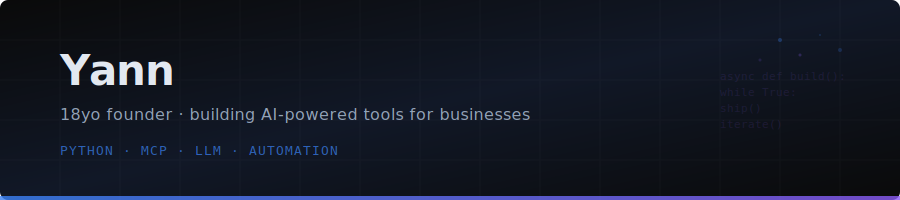

  

  &nbsp;
  &nbsp;
  &nbsp;
  &nbsp;
  &nbsp;
  

---

### Hey -- I'm Yann

18 years old. Self-taught. Solo founder from Strasbourg, France.
**103,000+ lines of Python** across **6 AI agents** built from scratch over 3 years.
Dropped out of engineering school (Epitech) to build things that generate revenue -- not diplomas.

Currently running **[YannService](https://yannservice.fr)** (subscription web agency for local businesses) and **NovaRadar** (automated lead discovery engine).

---

### What I've built

<table>
<tr>
<td width="50%" valign="top">

**Jarvis** -- Autonomous AI agent framework
My biggest project. Full agent architecture: event bus, task graph execution, multi-tier memory system, knowledge graph, sandboxed execution, permission layer, multi-LLM router. 950+ tests.
`Python` `async` `Pydantic` `multi-LLM` `103K+ lines`

</td>
<td width="50%" valign="top">

**NovaRadar** -- Lead discovery and scoring engine
Automated B2B prospecting for French SMBs. 16 web scanners, 3-layer scoring system (category-specific, universal bonuses, real-time timing via weather/time-slot/season), enrichment via French government APIs (SIREN, INSEE population data), full pipeline management.
`Python` `PostgreSQL` `async` `Google Maps API` `MCP (44 tools)`

</td>
</tr>
<tr>
<td width="50%" valign="top">

**MCP Ecosystem** -- 6 custom servers in production
All deployed on Railway, connected to AI assistants:
- **memory server**: persistent long-term memory with PostgreSQL, full-text search, 5 background agents
- **novaradar**: 44-tool CRM/prospecting interface
- **journal-discipline**: daily tracking with scoring (32 tools x 2 instances)
- **youtube**: channel management and analytics (14 tools)
- **brevo**: email automation via Brevo API
- **filesystem**: live code access via synced directory

</td>
<td width="50%" valign="top">

**Discipline Journal** -- [journal.novaia.org](https://journal.novaia.org)
Flask app built for personal use -- **500+ consecutive days** tracked. 8 tasks across 3 categories (Structure, Business, Growth), 20-point scoring system with streaks, tags, daily inputs, and analytics. Started as my CS50 Harvard final project, now a full product with MCP API and admin panel.
`Flask` `PostgreSQL` `Jinja2` `Railway`

</td>
</tr>
<tr>
<td width="50%" valign="top">

**YannService** -- [yannservice.fr](https://yannservice.fr)
Subscription web agency: websites for artisans and local businesses at 30/month. Near-zero marginal cost (Cloudflare hosting). Solo: sales, build, delivery. Stripe for recurring billing, NovaRadar for lead generation. Signed clients include carreleurs, peintres, and renovation companies.
`HTML/CSS/JS` `Cloudflare` `Stripe` `WordPress/Elementor`

</td>
<td width="50%" valign="top">

**AgentCheck** -- [agentcheck.fr](https://agentcheck.fr)
E-commerce AI-readiness audit tool. Scans online stores for compatibility with AI purchasing agents -- checks schema.org, product APIs, checkout programmability. Deployed on Railway with FastAPI/Docker.
`FastAPI` `Docker` `Railway` `Cloudflare`

</td>
</tr>
</table>

<b>Earlier projects and background</b>

 

- **Agent Scan Commerce** -- 3 versions built (V1 to V3), editable Python install, pre-filter e-commerce scoring, local LLM interpreter (Mistral/Llama3, zero API cost), circuit breaker
- **HotLeads** -- SaaS concept for freelancers, lead generation automation
- **NovaValidator** -- Lightweight data validation engine for CSV/JSON files
- **Spotify Family Bot** -- Automated management with Google Sheets API, SMTP, cron
- **CS50 Harvard** -- Completed the full course + verified edX certificate (Dec 2025)
- **NovaLove** -- Digital book project with video pipeline (Runway + Wisecut + Luma)
- **Various automation** -- Google Ads agent, site scrapers, bootloader experiments, COBOL exploration

---

### Stack

  
  
  
  
  
  
  
  
  
  
  

**Python (daily driver):** async/await, Pydantic, structlog, Rich, mypy strict, ruff, aiosqlite
**AI/LLM:** MCP protocol, Ollama local (Qwen 2.5 7B, Mistral 7B, Llama 8B), OpenAI API
**Backend:** FastAPI, Flask, uvicorn, SQLite to PostgreSQL
**Web:** HTML/CSS/JS, WordPress (Elementor), Webflow, Shopify, static sites
**Infra:** Docker, Railway, Cloudflare (Workers + DNS + Pages), OVH, Stripe, Brevo
**Low-level:** Bootloader, assembler, COBOL (exploration)

---

### GitHub Stats

  
  

  

---

### About the repos

Production code (Jarvis, NovaRadar, MCP servers, AgentCheck, client sites) lives in **private repos** and deployed Railway/Cloudflare services -- APIs, scoring logic, and business config don't belong in public.

What you'll find here: open-source tools, client demos, and projects from my CS50/automation learning phase. The real work is running live:

- **[yannservice.fr](https://yannservice.fr)** -- client-facing agency
- **[journal.novaia.org](https://journal.novaia.org)** -- 500+ day discipline streak
- **[agentcheck.fr](https://agentcheck.fr)** -- e-commerce audit tool
- **[novaia.org](https://novaia.org)** -- NovaIA hub
- **6 MCP servers** processing data on Railway daily

---

  

